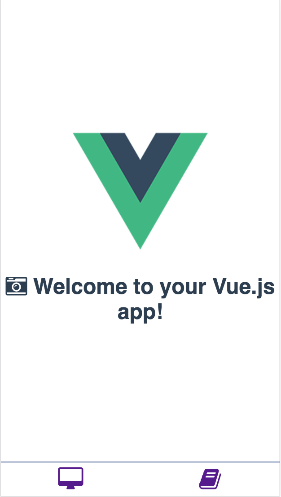

# Vue2-Webpack-SPA-template
基于Vue2 + Webpack 开发的SPA（单页应用）的模板生成项目。

## 使用命令行搭建项目环境
需要 `nodejs` 平台，下载新版即可，[nodejs 官网](https://nodejs.org/en/)  

```sh
# 安装 vue 生成工具
$ npm install -g vue-cli

# 使用自定义模版生成项目
$ vue init Ivanwangcy/Vue2-Webpack-SPA-template#daojia [daojia-project]
```
## 进入项目安装项目依赖的工具和库
- dependencies 项目开发所需的类库；
- devDependencies 项目运行所需的工具；
- 相关工具和库的用途和含义不明白的可在 github 自行查阅；
```sh
$ cd [daojia-project] && npm install

# 启动项目
$ npm start
```
## 启动成功页面

